# Buka 🍽️

A restaurant ordering app built with Flutter and Firebase that allows customers to browse menus, place orders, and track order status in real time — while giving restaurant owners a powerful admin dashboard to manage everything.

---

## 🚀 Coming Soon to Google Play

The app is currently in final preparation and will be available on the Google Play Store soon. Stay tuned!

---

## Screenshots

  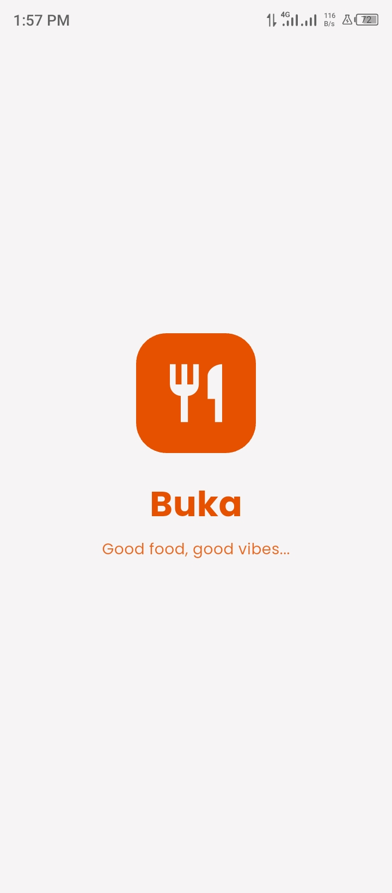
  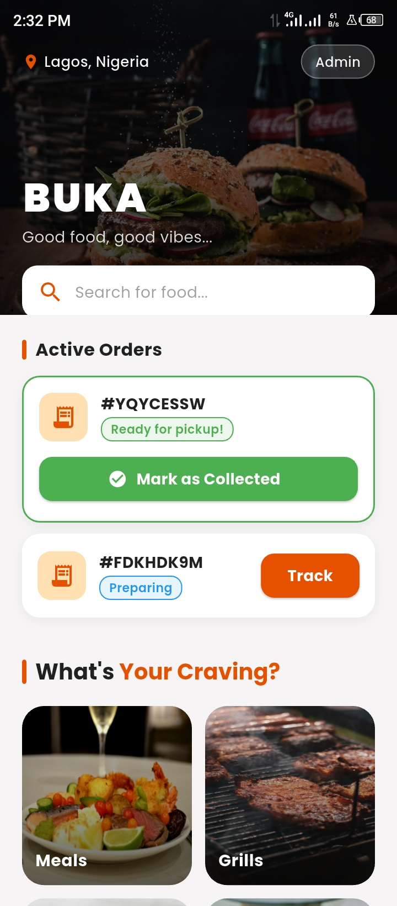
  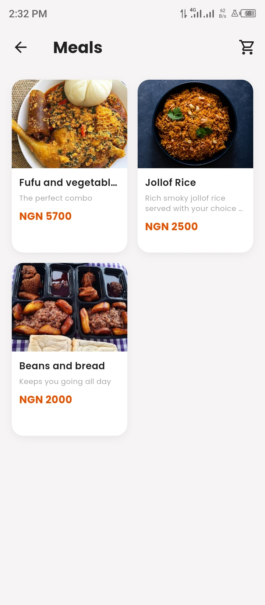
  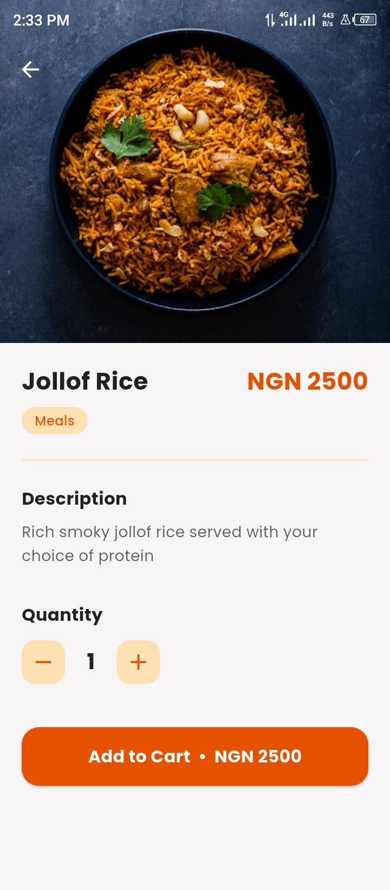
  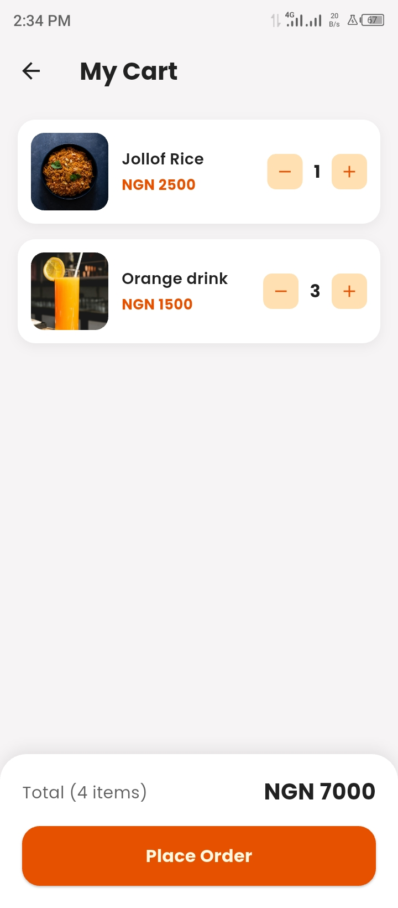
  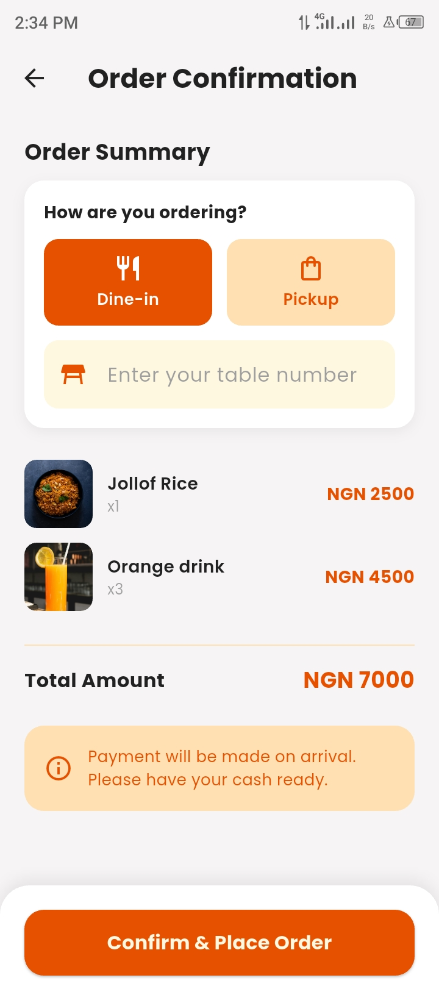
  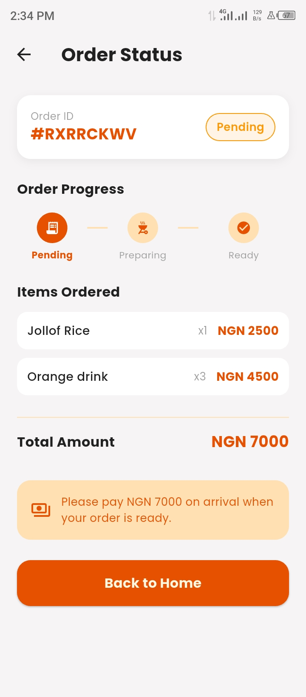
  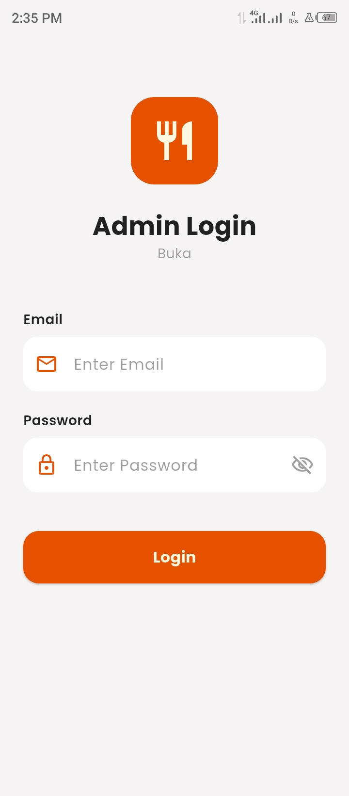
  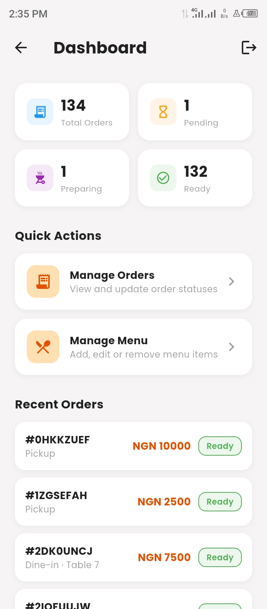
  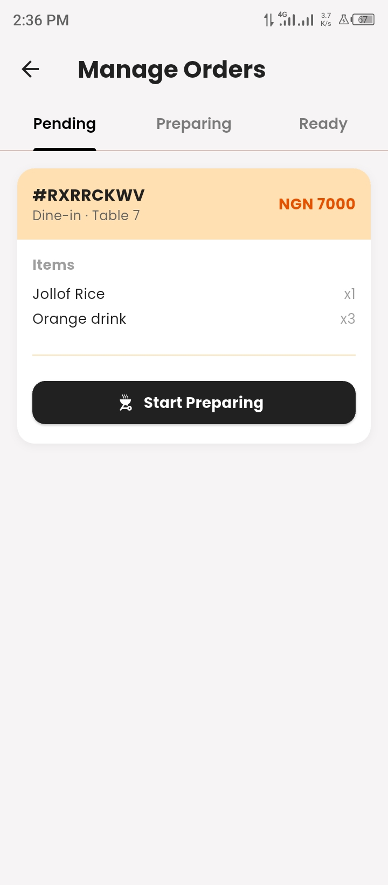
  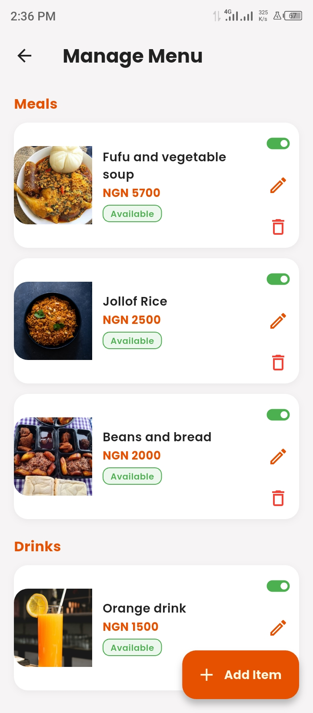
  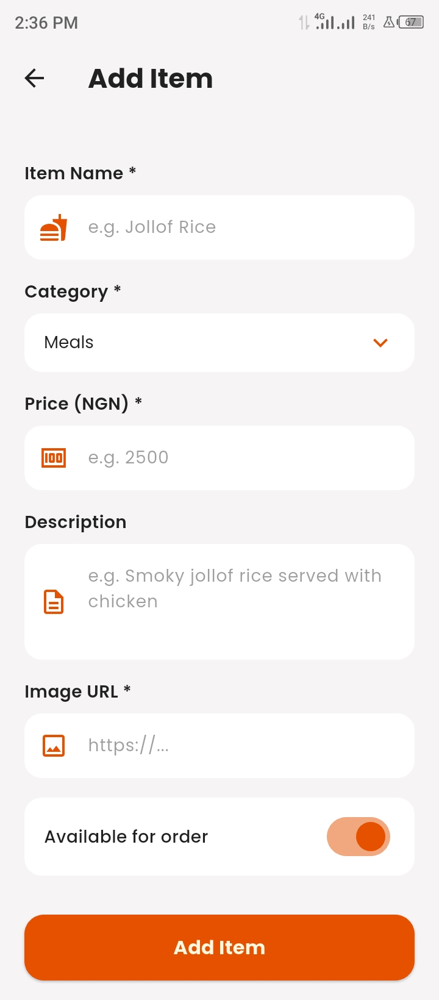

---

## Features

### Customer Side
- 🏠 **Home Screen** — Browse food categories with a premium UI and real-time active order tracking
- 🔍 **Search** — Search for food items by name or category in real time
- 📋 **Menu** — Browse food items by category with photos, names and prices
- 🍽️ **Item Detail** — View full item details and adjust quantity before adding to cart
- 🛒 **Cart** — Review items, adjust quantities and see total price before placing order
- 📦 **Order Placement** — Choose between Dine-in (with table number) or Pickup
- 📍 **Order Tracking** — Track order status in real time (Pending → Preparing → Ready)
- 🔔 **Push Notifications** — Get notified instantly when your order is ready
- 💵 **Pay on Arrival** — Simple cash payment when food is ready, no online payment needed

### Admin Side
- 🔐 **Secure Login** — Email and password authentication via Firebase Auth
- 📊 **Dashboard** — Overview of total, pending, preparing and ready orders at a glance
- 📋 **Order Management** — View incoming orders by status and update them in real time
- 🍴 **Menu Management** — Add, edit, delete and toggle availability of menu items
- 🖼️ **Image Support** — Add food photos via image URL for each menu item

### General
- ⚡ **Real-time Updates** — All order status changes reflect instantly across customer and admin
- 🔒 **Firestore Security Rules** — Proper rules ensuring only authenticated admins can modify data
- 📱 **Responsive UI** — Clean, premium design optimized for Android

---

## Built With

- [Flutter](https://flutter.dev/) — UI framework
- [Firebase Authentication](https://firebase.google.com/products/auth) — Admin login and authentication
- [Cloud Firestore](https://firebase.google.com/products/firestore) — Real-time cloud database
- [Provider](https://pub.dev/packages/provider) — State management for cart
- [flutter_local_notifications](https://pub.dev/packages/flutter_local_notifications) — Push notifications
- [shared_preferences](https://pub.dev/packages/shared_preferences) — Local order ID storage
- [cached_network_image](https://pub.dev/packages/cached_network_image) — Efficient image loading
- [google_fonts](https://pub.dev/packages/google_fonts) — Poppins typography
- [permission_handler](https://pub.dev/packages/permission_handler) — Notification permission handling

---

## Architecture

- **Pattern:** Feature-based folder structure
- **State Management:** Provider (CartProvider for cart state)
- **Backend:** Firebase (Auth + Firestore)
- **Notifications:** Flutter Local Notifications

---

## Author

**Ajose Emmanuel**
